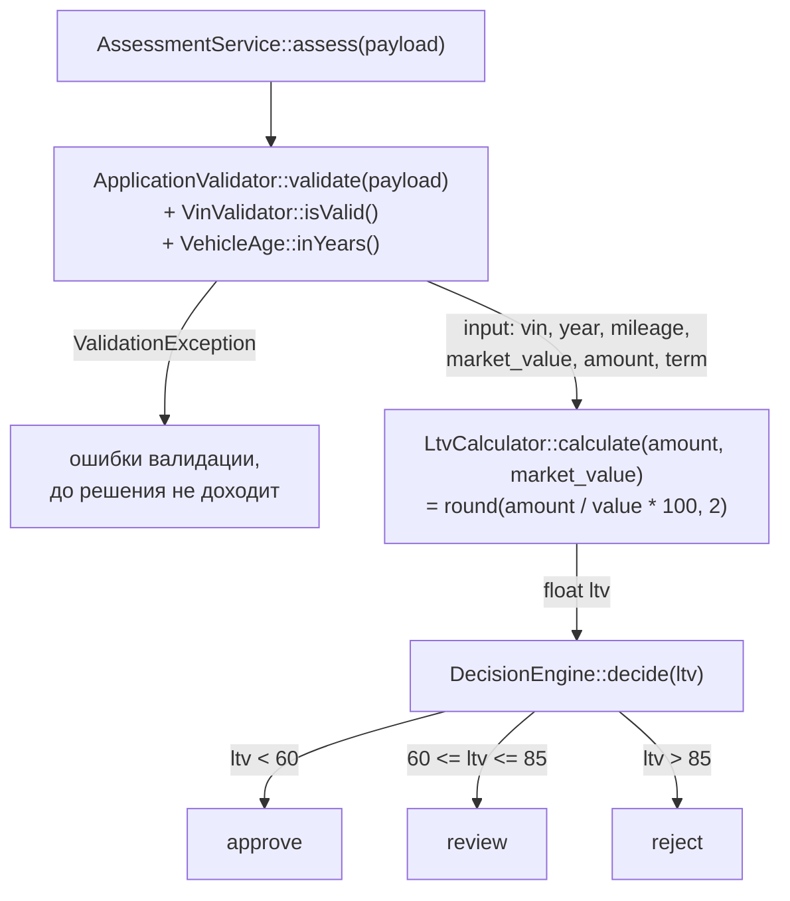

# Как считается решение по заявке: карта кода

Все участники — в `backend/src/Domain/`, пороги — в `backend/config/rules.php`.

## 1. Файлы, функции, порядок

Порядок вызовов:

1. **`AssessmentService::assess(array $payload)`** (`AssessmentService.php:28`) — точка входа, только оркестрация: валидация → LTV → решение.
2. **`ApplicationValidator::validate($payload)`** (`ApplicationValidator.php:24`) — нормализует и проверяет шесть полей. Внутри вызывает:
   - `VinValidator::isValid($vin)` (строка 29) — длина 17, алфавит `A-Z0-9`, без `I/O/Q` (значения из `rules.php → vin`);
   - `VehicleAge::inYears($year)` (строка 34) — для проверок «год не в будущем» и «возраст ≤ 20 лет» (`rules.php → vehicle`).

   При любой ошибке бросается `ValidationException` (строка 72) — заявка **не доходит до расчёта решения вообще**. Иначе возвращается нормализованный массив `vin, year, mileage, market_value, requested_amount, term_months`.
3. **`LtvCalculator::calculate(requested_amount, market_value)`** (`LtvCalculator.php:15`) — `round(сумма / стоимость * 100, 2)`, проценты с двумя знаками; нулевые аргументы отбрасывает исключением.
4. **`DecisionEngine::decide(float $ltv)`** (`DecisionEngine.php:30`) — **единственное место, где рождается decision**. Пороги приходят в конструктор из `rules.php → ltv` (`approve_max = 60.0`, `review_max = 85.0`):
   - `$ltv < 60.0` → `APPROVE`;
   - `60.0 ≤ $ltv ≤ 85.0` → `REVIEW`;
   - `$ltv > 85.0` → `REJECT`.

   Нюанс: комментарии в `rules.php:39` и docblock `DecisionEngine.php:10-12` обещают «`LTV <= approve_max → approve`», но код в строке 32 проверяет **строгое** `$ltv < $this->approveMax` — при LTV ровно 60.0 решение будет `review`, а не `approve`.
5. Обратно в `assess()`: `approved_limit` = запрошенная сумма при `approve`, иначе 0 (строка 39); `vehicle_age` через `VehicleAge::inYears()` считается **только для ответа**, на решение не влияет.

Ключевой факт: **решение зависит только от LTV**. Возраст, пробег, срок на него не влияют никак.

## 2. Куда встанет правило «пробег > 400 000 км → review»

**Функция:** `DecisionEngine::decide()` — потому что это единственное место, где производится строка решения. **Место:** внутри ветки approve, т.е. первый `if` (строки 32–34), перед `return self::APPROVE`. Логика вставки: высокий пробег должен **понижать** `approve` до `review`, но не «повышать» `reject` до `review` — поэтому проверку нельзя ставить слепо первой, до LTV-проверок.

Что для этого **уже есть**:

- `mileage` валидируется и возвращается в нормализованном `$input` (`ApplicationValidator.php:43-46, 78`);
- `AssessmentService::assess()` уже держит `$input['mileage']` в момент вызова `decide()` (строки 30–33) — его просто нужно передать вторым аргументом;
- в `rules.php` есть секция `vehicle`, куда естественно ляжет новый порог (рядом с `max_mileage_km`);
- константа `DecisionEngine::REVIEW` уже существует.

Чего **не хватает**:

- у `decide()` сигнатура `decide(float $ltv)` — параметра «пробег» нет; придётся менять сигнатуру (это же ломает вызов `decide($ltv)` в `tests/Unit/DecisionEngineTest.php:23`);
- конструктор `DecisionEngine` принимает только `approve_max`/`review_max` — порога 400 000 в `rules.php` **нет**, ключ надо добавить и прокинуть в конструктор;
- в коде **нет** правила приоритета: что делать, если LTV даёт `reject`, а пробег — `review` (какое решение главнее). Это нигде не определено — нужно решение по спеке.

Альтернативное место — перехват в `AssessmentService::assess()` после `decide()` (там уже есть и `$input['mileage']`, и `$decision`), но это размазывает бизнес-правило по оркестратору — по структуре проекта правила решения живут в `DecisionEngine`.

## 3. Что прямо сейчас проверяется про пробег

Единственная проверка — **`ApplicationValidator::validate()`, строки 43–46**: `mileage` приводится к int (если поля нет — значение по умолчанию −1) и должно удовлетворять `0 ≤ mileage ≤ rules['vehicle']['max_mileage_km']`, где порог **500 000** (`rules.php:23`). Нарушение — это `errors['mileage']` → `ValidationException`, то есть **ошибка валидации, а не решение `review`**: такая заявка вообще не доходит до `DecisionEngine`.

После валидации пробег только пробрасывается дальше: возвращается в `$input` (строка 78), попадает в ответ `assess()` в поле `input` и сохраняется в БД через `ApplicationRepository` (`mileage_km`). На LTV и на решение он не влияет. В `DecisionEngine`, `LtvCalculator`, `VehicleAge`, `VinValidator` пробега нет. Других проверок пробега в коде **нет**.